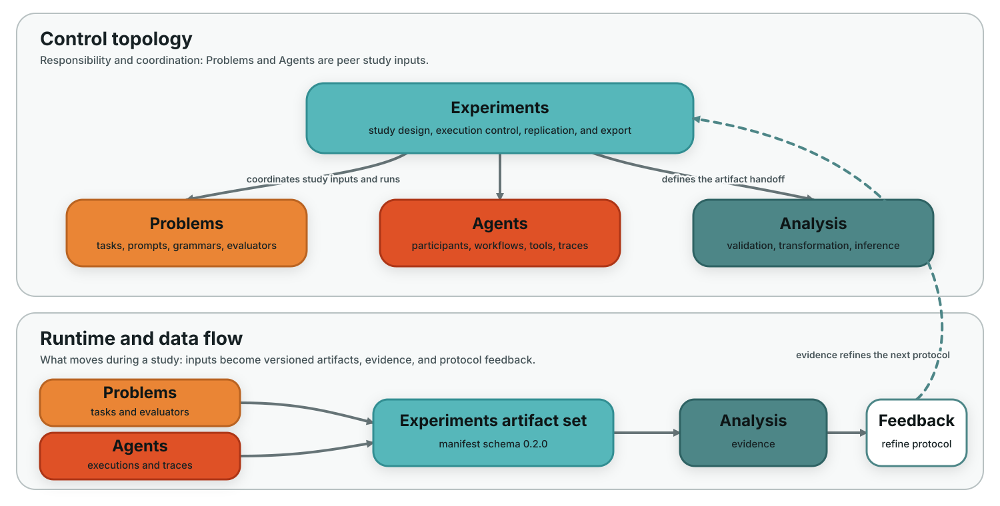

design-research-problems
========================

A library of benchmark tasks for design research.

What This Library Does
----------------------

``design-research-problems`` provides structured design tasks spanning
ideation, decision-making, optimization, grammar-based design exploration, and
MCP-backed workflows. We use it to package reusable task definitions with clear
metadata, evaluators, and domain structure.

Highlights
----------

- Text prompts
- Decision problems
- Optimization problems
- Grammar problems
- MCP-backed tasks
- Typed metadata

Different problem families support different forms of inquiry. Text problems are
well suited for prompt-based and human-subjects studies. Optimization problems
support algorithmic benchmarking. Grammar problems support constructive search
and sequential design behavior. MCP-backed tasks connect studies to external
execution systems.

Typical Workflow
----------------

1. Browse the catalog and choose a family aligned with the study question.
2. Load a problem and inspect state, constraints, prompt content, or evaluator behavior.
3. Generate candidate solutions or trajectories.
4. Evaluate outputs and collect artifacts.
5. Hand tasks to agents directly or bind them into studies via experiments.

Integration With The Ecosystem
------------------------------

The Design Research Collective maintains a modular ecosystem of libraries for
studying human and AI design behavior.

- **design-research-agents** implements AI participants, workflows, and tool-using reasoning patterns.
- **design-research-problems** provides benchmark design tasks, prompts, grammars, and evaluators.
- **design-research-analysis** analyzes the traces, event tables, and outcomes generated during studies.
- **design-research-experiments** sits above the stack as the study-design and orchestration layer, defining hypotheses, factors, conditions, replications, and artifact flows across agents, problems, and analysis.

Together these libraries support end-to-end design research pipelines, from
study design through execution and interpretation.

Start Here
----------

- :doc:`quickstart`
- :doc:`installation`
- :doc:`concepts`
- :doc:`typical_workflow`
- :doc:`examples/index`
- :doc:`problem_catalog/index`
- :doc:`api`

.. toctree::
   :maxdepth: 2
   :caption: Documentation
   :hidden:

   quickstart
   installation
   concepts
   typical_workflow
   examples/index
   api

.. toctree::
   :maxdepth: 2
   :caption: Development
   :hidden:

   dependencies_and_extras
   Contributing <https://github.com/cmudrc/design-research-problems/blob/main/CONTRIBUTING.md>

.. toctree::
   :maxdepth: 2
   :caption: Additional Guides
   :hidden:

   problems/index
   problem_catalog/index
   reference/index
